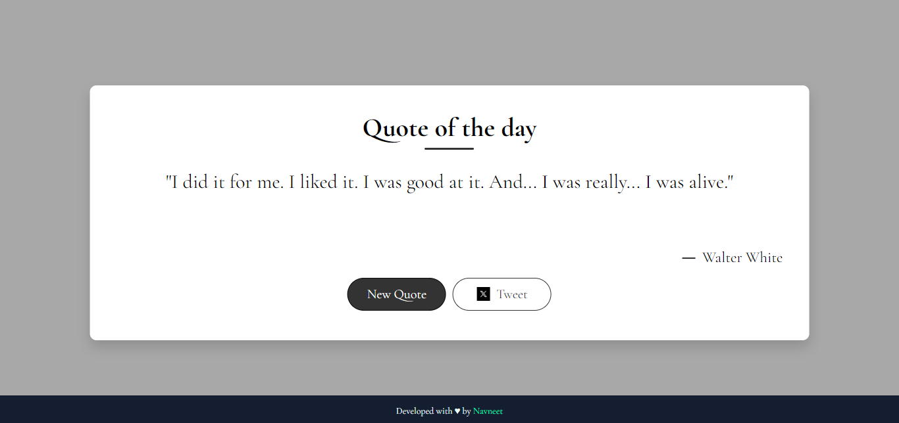

# Quotify - Makes your day!

Quotify is a simple web application that displays a random quote from the Breaking Bad series. Users can get a new quote by clicking a button and can also tweet the displayed quote.

## Table of Contents

- [Demo](#demo)
- [Features](#features)
- [Installation](#installation)
- [Usage](#usage)
- [Technologies Used](#technologies-used)

## Demo



## Features

- Displays a random quote from the Breaking Bad series.
- Fetches quotes from the Breaking Bad Quotes API.
- Allows users to tweet the displayed quote.
- Responsive design for both desktop and mobile devices.

## Installation

1. Clone the repository:

   ```bash
   git clone https://github.com/nav2103/quotify.git
   cd quotify
   ```

2. Open `index.html` in your web browser.

## Usage

1. Open `index.html` in your preferred web browser.
2. Click on the "New Quote" button to fetch a new random quote.
3. Click on the "Tweet" button to tweet the displayed quote.

## Technologies Used

- HTML
- CSS
- JavaScript
- [Breaking Bad Quotes API](https://breakingbadquotes.xyz/)

## File Structure

```
quotify/
│
├── index.html
├── style.css
├── script.js
├── demo.png
├── x-logo.jpeg
└── README.md
```

## Contact

If you have any questions or suggestions, feel free to reach out:

- GitHub: [Navneet](https://github.com/nav2103)
- Email: navneetsingh2103@gmail.com
